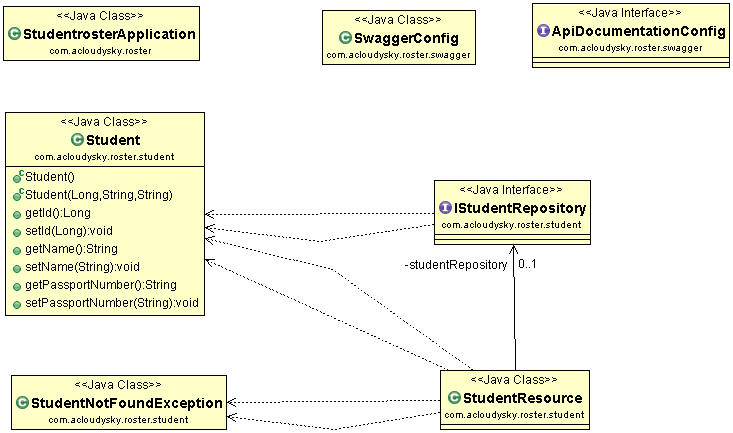
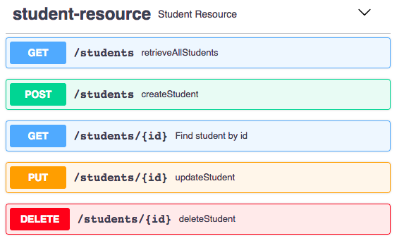
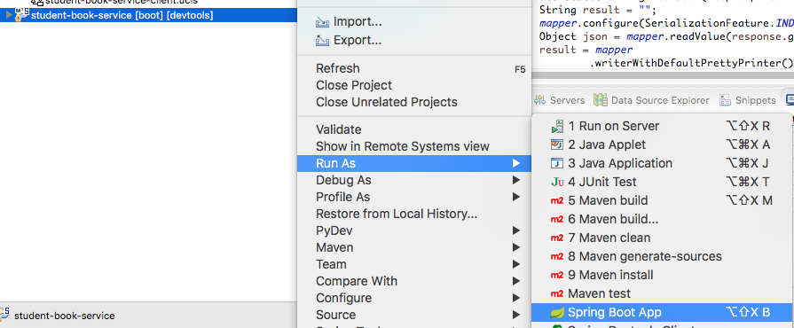

# Student Book Service
The **student-book-service** allows to create and manage a list of students. You can use it to organize your student list which you can access at any time from anywhere an Internet connection is available. The service can be used by anyone from students, to faculty, from professionals on the roads to anyone that needs the list readly available. 
The fairly simple interface allows easy access via your laptop or cell phone.

## Conceptual
The **student-book-service** is built in Java using the Spring Boot technology. See [Spring Boot for Beginners in 10 Steps](https://courses.in28minutes.com/p/spring-boot-for-beginners-in-10-steps). It also integrates Swagger libraries for the generatioon of documentation. See [Springfox Reference Documentation](https://springfox.github.io/springfox/docs/current/). 

The following is the service class or architecture diagram. 

### Service Architectural Elements

- **SpringBoot2RestServiceApplication.java**. The Spring Boot Application class generated with **Spring Initializer**. This class acts as the launching point for the application.
- **Student.java**. Student JPA Entity.
- **StudentRepository.java**. Student JPA Repository. It is created using Spring Data JpaRepository.
- **StudentResource.java**. *Spring REST Controller* exposing all services on the student resource.
- **data.sql**. Contains initial data for the student table. Spring Boot executes this script after the tables are created from the entities.
- **ApiDocumentationConfig.java**. Meta Information about the API included in the documentation.
- **SwaggerConfig.java**. Contains the *Swagger Configuration* for generating documentation from the inline comments. 
- **pom.xml**. Contains all the dependencies needed to build this project. We will use **Spring Boot Starter AOP**.

### Prerequisites
To build the service you need the following:

- [Maven 3.0+](https://maven.apache.org/download.cgi) as your build tool.
- Your favorite IDE. We use [Eclipse](https://www.eclipse.org/).
- [JDK 1.8+](https://www.oracle.com/technetwork/java/javase/downloads/jdk8-downloads-2133151.html).

### About the Documentation
API documentation is an essential part of a well rounded REST service. This example generates documentation from inline comments in the code. In particulare the example uses [Swagger](https://swagger.io/) the most popular REST API documentation standard. 
 
The generated Swagger UI is similar to the following:
 

## Quick Start
The following examples are executed on a Web server, for example Tomcat, running on localhost.  

### Prerequisites

🚨To run the client app, you must assure first that the related service is up and running on the localhost port 8282.

1. In Eclipse, right click on the **student-book-service** server app.
1. From the drop down menu select **Run As->Spring Boot App**, as shon in the following figure.
 </img>
3. If the port 8282 on which the service must run is busy perform the following steps (on Mac):

		>> sudo lsof -i tcp:8282 /* display the processes running on port 8282 */
		>> kill -9 p#1 p#2 /* Kill the processes specified by their Id numbers. 

### Examples
#### POST
Open a terminal window and execute a curl command simnilar to the following:

		curl -X POST "https://localhost:8282/students" 
		-H "accept: application/json" 
		-H "Content-Type: application/json" 
		-d "{ 	\"email\": \"mikes@gmail.com\", 
				\"id\": 10007, 
				\"name\": \"mike smith\", 
				\"phoneNumber\": \"253 333 4444\"
			}" 
		
The following record is added to the book:

	{	"id":10007,
		"name":"mike smith",
		"email":"mikes@gmail.com",
		"phoneNumber":"253 333 4444"
	}
	

#### GET
After executing the POST command execute the following GET command to get all the student records:

	curl -X GET --header 'Accept: application/json' 
	http://localhost:8282/students

You wil get a response similar to the following:

	{
	  "id" : 10001,
	  "name" : "George Washington",
	  "email" : "georgew@email.com",
	  "phoneNumber" : "253 222 3456"
	}, {
	  "id" : 10002,
	  "name" : "Lucas Davenport",
	  "email" : "lucasd@email.com",
	  "phoneNumber" : "425 123 4567"
	}, {
	  "id" : 10003,
	  "name" : "Mary Smith",
	  "email" : "marys@email.com",
	  "phoneNumber" : "360 234 5678"
	}, {	"id":10007,
		"name":"mike smith",
		"email":"mikes@gmail.com",
		"phoneNumber":"253 333 4444"
	}
 
Execute the following command to obtain the new student record:

	curl -X GET --header 'Accept: application/json' 
	http://localhost:8282/students/10007

You get the following response:

	{	"id":10007,
		"name":"mike smith",
		"email":"mikes@gmail.com",
		"phoneNumber":"253 333 4444"
	}

	
### Using a Client App
Noramlly you interact with the service using its API from within your clinet application. To see how to create and use such application, refer to <a href="https://github.com/milexm/student-book-client">Student Book Service Client</a>. 
	

## API Reference
The following is the service REST API reference documentation. Code snippets show how to use the various methods.

### GET 
Gets the information of the student with the specified Id. The returned data is in JSON format. 

- URL: **/students/{id}**
- Url Parameters: 
	- id [integer]: **Required**. 
- Data Parameters: **None**.
- Auth required: **Yes**
- Permissions: **None**
- Success Response: **200 OK**
- Error Response: 
	- **401 Unhauthorized**
	- **403 Forbidden**
	- **404 Not Found**

#### Examples

##### Curl 
Submit a request similar to the followng to obtain the information for the student with the specific Id:

	curl -X GET --header 'Accept: application/json' 
	http://localhost:8282/students/10007
	
The response is similar to the following:

	{   
		"id":10007,
	    "name":"mike smith",
	    "email":"mikes@mail.com",
	    "phoneNumber":"425 444 0000"
	}

Submit the following request to obtain the information for all students:

	curl -X GET --header 'Accept: application/json' 
		http://localhost:8282/students

##### Java
The following Java function uses the Apache HttpClient library to issue the service GET request.
It obtains a single student or all students information. The paramater url is one of the following: 

- The resource end-point address such as: http://localhost:8282/students/ for all students or
- The resource end-point address such as: http://localhost:8282/students/10001 for a single student. 

La funzione returns  the student info in JSON format.

	public static String Get(String url) throws 
	ClientProtocolException, IOException {
		HttpClient client = 	
			HttpClientBuilder.create().build();
		HttpGet request = new HttpGet(url); 
		HttpResponse response = client.execute(request);
		return readJson(response);
	 }

### POST
Creates a student record using the information entered by the user in JSON format. 

- URL: **/students**
- Url Parameters: **None**. 
- Data Parameters: **Required**.

		{
  			"email": "string",
  			"id": 0,
  			"name": "string",
  			"phoneNumber": "string"
		}
- Auth required: **Yes**
- Permissions: **None**
- Success Response: **201 Created**
- Error Response: 
	- **401 Unhauthorized**
	- **403 Forbidden**
	- **404 Not Found**

#### Examples

##### Curl 
Submit a request similar to the followng to create a student record with the specified information:

	curl -X POST "http://localhost:8282/students" 
	-H "accept: application/json" 
	-H "Content-Type: application/json" 
	-d "{ 
			\"email\": \"mikes@mail.com\", 
			\"id\": 10007, 
			\"name\": \"mike smith\", 
			\"phoneNumber\": \"253 111 2222\"
		}"
	
Submit the following request to verify the record is created: 

	curl -X GET --header 'Accept: application/json' 
		http://localhost:8282/students/10007

The response is the following:

	{   
		"id":10007,
	    "name":"mike smith",
	    "email":"mikes@mail.com",
	    "phoneNumber":"425 444 0000"
	}

##### Java
The following Java function uses the Spring Boot framework to issue the service POST request.
It creates a single student recod based on the passed information. 
The paramater **url** is the resource end-point address such as: http://localhost:8282/students/ for all students. 
 
The function returns a message about the operation success or failure the student.

	public static String Post(String url, 
	Student student) throws 
	ClientProtocolException, IOException, 
	HttpServerErrorException {
	
	  String result = "Student entry created.";
      
	  // Instantiate headers.
      HttpHeaders headers = new HttpHeaders();
      
      // headers.add("Accept", "APPLICATION_JSON");
      headers.setContentType(MediaType.APPLICATION_JSON);
 
      // Instantiate rest template. 
      RestTemplate restTemplate = new RestTemplate();
 
      // Attach data to the request.
      HttpEntity<Student> requestBody = new 
      HttpEntity<>(student, headers);
 
      // Issue POST request.
      restTemplate.postForObject(url, requestBody, 
      Student.class);
      
      return result;
      
	}

### PUT
Updates a student record with the specified Id using the information entered by the user in JSON format. 

- URL: **/students**
- - Url Parameters: 
	- id [integer]: **Required**. 
- Data Parameters: **Required**.

		{
  			"email": "string",
  			"id": 0,
  			"name": "string",
  			"phoneNumber": "string"
		}
- Auth required: **Yes**
- Permissions: **None**
- Success Response: **201 Updated**
- Error Response: 
	- **401 Unhauthorized**
	- **403 Forbidden**
	- **404 Not Found**

#### Examples

##### Curl 
Submit a request similar to the followng to update a student record with the specified information:

	curl -X POST "http://localhost:8282/students/10007" 
	-H "accept: application/json" 
	-H "Content-Type: application/json" 
	-d "{ 
			\"email\": \"georgs@mail.com\", 
			\"id\": 10007, 
			\"name\": \"george smith\", 
			\"phoneNumber\": \"253 444 5555\"
		}"
	
Submit the following request to verify the record is updated: 

	curl -X GET --header 'Accept: application/json' 
		http://localhost:8282/students/10007

The response is the following:

	{   
		"id":10007,
	    "name":"george smith",
	    "email":"georges@mail.com",
	    "phoneNumber":"253 444 5555"
	}

##### Java
The following Java function uses the Spring Boot framework to issue the service PUT request.
It updates student recod specified by the Id and based on the passed information. 
The paramater **url** is the resource end-point address such as: http://localhost:8282/students/10007 for the specified student record. 
 
The function returns a message about the operation success or failure. 

	public static String Put(String url, Student student) throws 
	ClientProtocolException, 
	IOException, HttpServerErrorException {
		
		String result = "Student record not updated."; 
		
		// Instantiate headers.
	    HttpHeaders headers = 
	    	new HttpHeaders();   
		headers.setContentType(
			MediaType.APPLICATION_JSON);
	 
	    // Instantiate rest template. 
	    RestTemplate restTemplate = 
	    	new RestTemplate();
	 
	    // Attach data to the request.
	    HttpEntity<Student> requestBody = 
	    	new HttpEntity<>(student, headers);
	 
	    // Issue POST request.
	    restTemplate.put(url, requestBody, 
	    	new Object[] {});
	 
        Student s = 
        	restTemplate.getForObject(url,
        		Student.class);
        if (s != null) {
            result = "Student record updated."; 
        }
        
        return result; 
    }
	 

### DELETE
Deletes the record of the student with the specified Id.

- URL: **/students/{id}**
- Url Parameters: 
	- id [integer]: **Required**. 
- Data Parameters: **None**.
- Auth required: **Yes**
- Permissions: **None**
- Success Response: **200 OK**
- Error Response: 
	- **401 Unhauthorized**
	- **403 Forbidden**
	- **204 No Content**

#### Examples

##### Curl 
Submit a request similar to the followng to delete the record of the student with the specific Id:

	curl -X DELETE "https://localhost:8282/students/10007" -H "accept: application/json"
	
Submit the following request to verify the record has been deleted: 

	curl -X GET --header 'Accept: application/json' 
		http://localhost:8282/students

The response is similar to the following:

	{
	  "id" : 10001,
	  "name" : "George Washington",
	  "email" : "georgew@email.com",
	  "phoneNumber" : "253 222 3456"
	}, {
	  "id" : 10002,
	  "name" : "Lucas Davenport",
	  "email" : "lucasd@email.com",
	  "phoneNumber" : "425 123 4567"
	}, {
	  "id" : 10003,
	  "name" : "Mary Smith",
	  "email" : "marys@email.com",
	  "phoneNumber" : "360 234 5678"
	} 

##### Java
The following Java function uses Spring Boot framework to issue the service DELETE request.
The paramater url is simlar to the following: 

	http://localhost:8282/students/10007 

The function returns a message about the operation success or failure. 

	public static String Delete(String url) 
	throws ClientProtocolException, 
	IOException, HttpServerErrorException {
	 	
		String result = "Student record not deleted."; 
		
		// Instantiate template. 
        RestTemplate restTemplate = new RestTemplate();
 
        // Issue DELETE request.
        restTemplate.delete(url);
 
        result = "Student record deleted."; 
        
        return result;
	   
	}	

## Use Cases
Describe real use case scenarios showing how the service is used. 

## Support
Describe how to ask for support.

## References
- [Developing RESTful Web Services with JAX-RS](https://docs.oracle.com/cd/E19798-01/821-1841/gilik/index.html)
- [Springfox Reference Documentation](https://springfox.github.io/springfox/docs/current/)
- [Spring Boot for Beginners in 10 Steps](https://courses.in28minutes.com/p/spring-boot-for-beginners-in-10-steps)